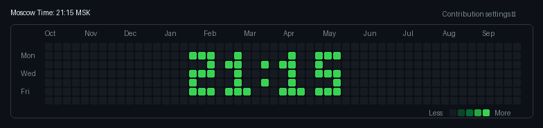

<!-- README.md -->

  # Привет, я lilcodder 👋
  
  

    <b>Fullstack Developer & Audio Enthusiast</b>
  

  <!-- Соцсети и контакты -->
  
  
  

---

### 🚀 Обо мне

* 💻 Разрабатываю веб-приложения на **React**, интерфейсы в стиле **Material Design 3** и сервисы на **Python / C#**.
* ⚙️ Люблю DIY-электронику, микроконтроллеры (**ESP32**) и системные эксперименты с Linux.
* 🎧 В свободное время занимаюсь диджеингом и саунд-дизайном.
* 📍 Базируюсь в Челябинске.

---

### 🛠 Стек технологий

**Frontend & Mobile**

  

**Backend & Tools**

  

---

### 📊 Статистика профиля

  
  

  <picture>
    <source media="(prefers-color-scheme: dark)" srcset="./commit_clock_dark.gif">
    <source media="(prefers-color-scheme: light)" srcset="./commit_clock_light.gif">
    
  </picture>

---

  Собрано с любовью к чистому коду и хорошему звуку 🎛️

  <picture>
    <source media="(prefers-color-scheme: dark)" srcset="https://mail.lilcodder.xyz/clock.gif?theme=dark">
    <source media="(prefers-color-scheme: light)" srcset="https://mail.lilcodder.xyz/clock.gif?theme=light">
    
  </picture>

